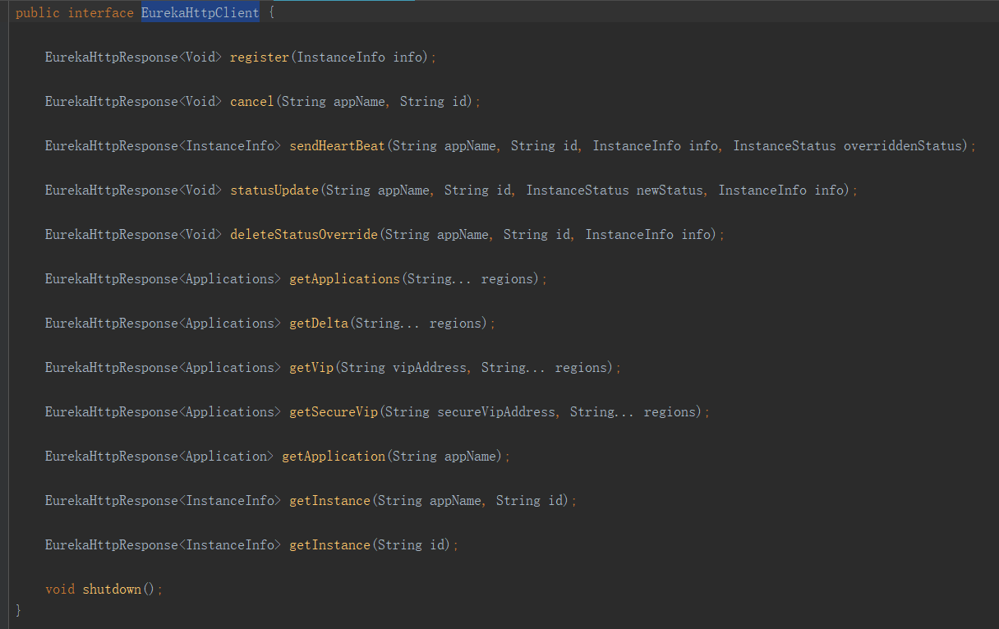
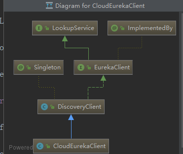
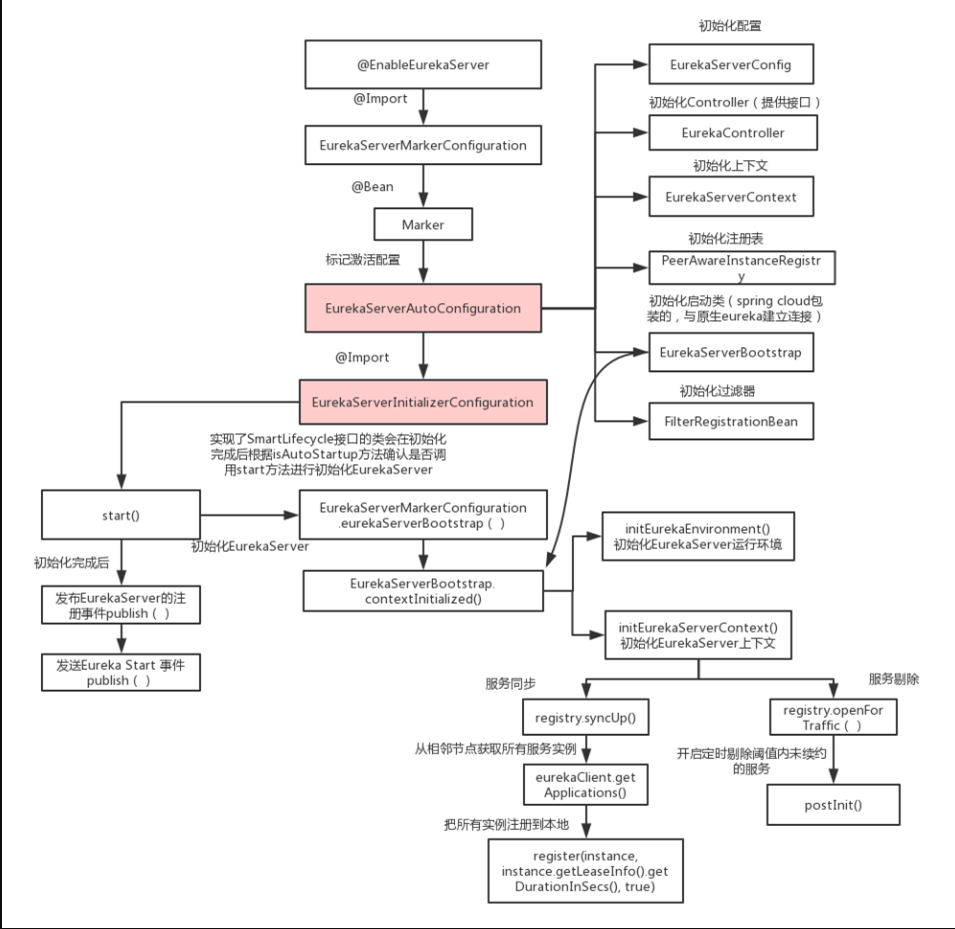

# Eureka

## 概览

客户端与服务端交互的接口com.netflix.discovery.shared.transport.EurekaHttpClient



### 服务注册

​	服务发送rest请求向服务注册中心注册，携带自身的ip、port等，维护在一个双层map中

#### 服务端

最下面instanceRegisrty是spring的主要负责事件的发布服务注册相关工作有netflix的eureka组件负责


- 接收注册请求

  com.netflix.eureka.resources.ApplicationResource#addInstance方法（使用的jersey实现rest）

- 检查续约时间设定

  org.springframework.cloud.netflix.eureka.server.InstanceRegistry#resolveInstanceLeaseDuration

```java
//如果服务提供者没有设置或者设置时间无效就使用默认值，反之使用设置的值
private int resolveInstanceLeaseDuration(final InstanceInfo info) {
		int leaseDuration = Lease.DEFAULT_DURATION_IN_SECS;
		if (info.getLeaseInfo() != null && info.getLeaseInfo().getDurationInSecs() > 0) {
			leaseDuration = info.getLeaseInfo().getDurationInSecs();
		}
		return leaseDuration;
	}
//服务提供者设定的参数值
org.springframework.cloud.netflix.eureka.EurekaInstanceConfigBean#leaseExpirationDurationInSeconds
```

- 发布服务注册事件

  org.springframework.cloud.netflix.eureka.server.InstanceRegistry#handleRegistration

-  注册到服务中心

  com.netflix.eureka.registry.AbstractInstanceRegistry#register

  ```java
  //注册信息维护在一个双层map中，外层key是appName，内层key是instenceId
  private final ConcurrentHashMap<String, Map<String, Lease<InstanceInfo>>> registry
              = new ConcurrentHashMap<String, Map<String, Lease<InstanceInfo>>>();
  
  //InstanceInfo  每个服务的属性实例
  //Lease  服务注册状态的实例，
  
  
  //注册时检测是否已存在当前appName的instanceId的应用，如果存在且还没有过期就使用原先存在的InstanceInfo，只需要更新一些属性，否则使用注册请求的InstanceInfo
  ```

  

- 将信心同步到兄弟节点

  com.netflix.eureka.registry.PeerAwareInstanceRegistryImpl#replicateToPeers

  ```java
   
              //如果是其他节点同步过来或者服务为空就不同步		
              if (peerEurekaNodes == Collections.EMPTY_LIST || isReplication) {
                  return;
              }
  
              for (final PeerEurekaNode node : peerEurekaNodes.getPeerEurekaNodes()) {
                  //自身忽略
                  if (peerEurekaNodes.isThisMyUrl(node.getServiceUrl())) {
                      continue;
                  }
                  replicateInstanceActionsToPeers(action, appName, id, info, newStatus, node);
              }
  ```

  

#### 客户端

cloudEurekaClient是spring实现的用于自动配置类是启动eureka，上面的都是netflix原生实现




- 初始化服务端

  ```java
  org.springframework.cloud.netflix.eureka.EurekaClientAutoConfiguration.EurekaClientConfiguration#eurekaClient  自动配置类进行初始化，构造父类时进行一些列操作
  
  参数设置、各种监视器初始化
  
   if (!config.shouldRegisterWithEureka() && !config.shouldFetchRegistry())
       检测当不需要注册 也不需要收索服务时直接放回
  ```

  ```java
  创建调度器以及心跳检测执行器和服务收索执行器
  ```

  ```java
  创建httpcilent
  ```

  ```java
  区域信息设置
  ```

  ```java
   if (clientConfig.shouldFetchRegistry() && !fetchRegistry(false)) {
              fetchRegistryFromBackup(); 
       }
  从注册中心获取服务，如果全部失败就使用默认的地址获取
  ```

  ```java
  if (this.preRegistrationHandler != null) {
              this.preRegistrationHandler.beforeRegistration();
     }
  注册前置处理
  
  ```

  ```java
  开启续约定时任务
   scheduler.schedule(
                      new TimedSupervisorTask(
                              "heartbeat",
                              scheduler,
                              heartbeatExecutor,
                              renewalIntervalInSecs,
                              TimeUnit.SECONDS,
                              expBackOffBound,
                              new HeartbeatThread()
                      ),
                      renewalIntervalInSecs, TimeUnit.SECONDS);
  ```
  
  ```java
  注册
  instanceInfoReplicator = new InstanceInfoReplicator(
                      this,
                    instanceInfo,
                      clientConfig.getInstanceInfoReplicationIntervalSeconds(),
                      2); // burstSize
  
  //状态监听器
              statusChangeListener = new ApplicationInfoManager.StatusChangeListener() {
                  @Override
                  public String getId() {
                      return "statusChangeListener";
                  }
  
                  @Override
                  public void notify(StatusChangeEvent statusChangeEvent) {
                      if (InstanceStatus.DOWN == statusChangeEvent.getStatus() ||
                              InstanceStatus.DOWN == statusChangeEvent.getPreviousStatus()) {
                        // log at warn level if DOWN was involved
                          logger.warn("Saw local status change event {}", statusChangeEvent);
                      } else {
                          logger.info("Saw local status change event {}", statusChangeEvent);
                      }
                      instanceInfoReplicator.onDemandUpdate();
                  }
              };
  
              if (clientConfig.shouldOnDemandUpdateStatusChange()) {
                  applicationInfoManager.registerStatusChangeListener(statusChangeListener);
              }
  
              instanceInfoReplicator.start(clientConfig.getInitialInstanceInfoReplicationIntervalSeconds());  //开始注册任务
  
  
  
  public void run() {
          try {
              discoveryClient.refreshInstanceInfo();
  
              Long dirtyTimestamp = instanceInfo.isDirtyWithTime();
              if (dirtyTimestamp != null) {
                  discoveryClient.register();  //注册
                  instanceInfo.unsetIsDirty(dirtyTimestamp);
              }
          } catch (Throwable t) {
              logger.warn("There was a problem with the instance info replicator", t);
          } finally {
              Future next = scheduler.schedule(this, replicationIntervalSeconds, TimeUnit.SECONDS);
              scheduledPeriodicRef.set(next);
          }
      }
  
  //发送注册请求
  boolean register() throws Throwable {
          logger.info(PREFIX + "{}: registering service...", appPathIdentifier);
          EurekaHttpResponse<Void> httpResponse;
          try {
              httpResponse = eurekaTransport.registrationClient.register(instanceInfo);
          } catch (Exception e) {
              logger.warn(PREFIX + "{} - registration failed {}", appPathIdentifier, e.getMessage(), e);
              throw e;
          }
          if (logger.isInfoEnabled()) {
              logger.info(PREFIX + "{} - registration status: {}", appPathIdentifier, httpResponse.getStatusCode());
          }
          return httpResponse.getStatusCode() == Status.NO_CONTENT.getStatusCode();
      }
  ```
  
  
  
  

com.netflix.discovery.DiscoveryClient#initScheduledTasks


- 发送请求执行注册

com.netflix.discovery.DiscoveryClient#register

### 服务续约

服务提供者每隔一定时间（30s）向注册中心发送请求进行续约，防止被剔除


#### 客户端

```java
 private class HeartbeatThread implements Runnable {

        public void run() {
            if (renew()) {
                lastSuccessfulHeartbeatTimestamp = System.currentTimeMillis();
            }
        }
    }


com.netflix.discovery.DiscoveryClient#renew

boolean renew() {
        EurekaHttpResponse<InstanceInfo> httpResponse;
        try {
            httpResponse = eurekaTransport.registrationClient.sendHeartBeat(instanceInfo.getAppName(), instanceInfo.getId(), instanceInfo, null);//发送续约请求
            logger.debug(PREFIX + "{} - Heartbeat status: {}", appPathIdentifier, httpResponse.getStatusCode());
            if (httpResponse.getStatusCode() == Status.NOT_FOUND.getStatusCode()) {
                REREGISTER_COUNTER.increment();
                logger.info(PREFIX + "{} - Re-registering apps/{}", appPathIdentifier, instanceInfo.getAppName());
                long timestamp = instanceInfo.setIsDirtyWithTime();
                boolean success = register();
                if (success) {
                    instanceInfo.unsetIsDirty(timestamp);
                }
                return success;
            }
            return httpResponse.getStatusCode() == Status.OK.getStatusCode();
        } catch (Throwable e) {
            logger.error(PREFIX + "{} - was unable to send heartbeat!", appPathIdentifier, e);
            return false;
        }
    }
```


#### 服务端


com.netflix.eureka.resources.InstanceResource#renewLease

```java
@PUT
    public Response renewLease(
            @HeaderParam(PeerEurekaNode.HEADER_REPLICATION) String isReplication,
            @QueryParam("overriddenstatus") String overriddenStatus,
            @QueryParam("status") String status,
            @QueryParam("lastDirtyTimestamp") String lastDirtyTimestamp) {
        boolean isFromReplicaNode = "true".equals(isReplication);
        boolean isSuccess = registry.renew(app.getName(), id, isFromReplicaNode);

        // Not found in the registry, immediately ask for a register
        if (!isSuccess) {
            logger.warn("Not Found (Renew): {} - {}", app.getName(), id);
            return Response.status(Status.NOT_FOUND).build();
        }
        // Check if we need to sync based on dirty time stamp, the client
        // instance might have changed some value
        Response response;
        if (lastDirtyTimestamp != null && serverConfig.shouldSyncWhenTimestampDiffers()) {
            response = this.validateDirtyTimestamp(Long.valueOf(lastDirtyTimestamp), isFromReplicaNode);
            // Store the overridden status since the validation found out the node that replicates wins
            if (response.getStatus() == Response.Status.NOT_FOUND.getStatusCode()
                    && (overriddenStatus != null)
                    && !(InstanceStatus.UNKNOWN.name().equals(overriddenStatus))
                    && isFromReplicaNode) {
                registry.storeOverriddenStatusIfRequired(app.getAppName(), id, InstanceStatus.valueOf(overriddenStatus));
            }
        } else {
            response = Response.ok().build();
        }
        logger.debug("Found (Renew): {} - {}; reply status={}", app.getName(), id, response.getStatus());
        return response;
    }
```


### 获取服务

​	服务注册时获取服务注册中心维护的只读服务列表默认服务和服务注册中心的列表都是30秒跟新

#### 服务端

全量获取

com.netflix.eureka.resources.ApplicationsResource#getContainers

```java
@GET
    public Response getContainers(@PathParam("version") String version,
                                  @HeaderParam(HEADER_ACCEPT) String acceptHeader,
                                  @HeaderParam(HEADER_ACCEPT_ENCODING) String acceptEncoding,
                                  @HeaderParam(EurekaAccept.HTTP_X_EUREKA_ACCEPT) String eurekaAccept,
                                  @Context UriInfo uriInfo,
                                  @Nullable @QueryParam("regions") String regionsStr) {

        boolean isRemoteRegionRequested = null != regionsStr && !regionsStr.isEmpty();
        String[] regions = null;
        if (!isRemoteRegionRequested) {
            EurekaMonitors.GET_ALL.increment();
        } else {
            regions = regionsStr.toLowerCase().split(",");
            Arrays.sort(regions); // So we don't have different caches for same regions queried in different order.
            EurekaMonitors.GET_ALL_WITH_REMOTE_REGIONS.increment();
        }

        // Check if the server allows the access to the registry. The server can
        // restrict access if it is not
        // ready to serve traffic depending on various reasons.
        if (!registry.shouldAllowAccess(isRemoteRegionRequested)) {
            return Response.status(Status.FORBIDDEN).build();
        }
        CurrentRequestVersion.set(Version.toEnum(version));
        KeyType keyType = Key.KeyType.JSON;
        String returnMediaType = MediaType.APPLICATION_JSON;
        if (acceptHeader == null || !acceptHeader.contains(HEADER_JSON_VALUE)) {
            keyType = Key.KeyType.XML;
            returnMediaType = MediaType.APPLICATION_XML;
        }

        Key cacheKey = new Key(Key.EntityType.Application,
                ResponseCacheImpl.ALL_APPS,
                keyType, CurrentRequestVersion.get(), EurekaAccept.fromString(eurekaAccept), regions
        );

        Response response;
        if (acceptEncoding != null && acceptEncoding.contains(HEADER_GZIP_VALUE)) {
            response = Response.ok(responseCache.getGZIP(cacheKey))
                    .header(HEADER_CONTENT_ENCODING, HEADER_GZIP_VALUE)
                    .header(HEADER_CONTENT_TYPE, returnMediaType)
                    .build();
        } else {
            response = Response.ok(responseCache.get(cacheKey))
                    .build();
        }
        return response;
    }
```


增量获取

com.netflix.eureka.resources.ApplicationsResource#getContainerDifferential

```java
@Path("delta")
    @GET
    public Response getContainerDifferential(
            @PathParam("version") String version,
            @HeaderParam(HEADER_ACCEPT) String acceptHeader,
            @HeaderParam(HEADER_ACCEPT_ENCODING) String acceptEncoding,
            @HeaderParam(EurekaAccept.HTTP_X_EUREKA_ACCEPT) String eurekaAccept,
            @Context UriInfo uriInfo, @Nullable @QueryParam("regions") String regionsStr) {

        boolean isRemoteRegionRequested = null != regionsStr && !regionsStr.isEmpty();

        // If the delta flag is disabled in discovery or if the lease expiration
        // has been disabled, redirect clients to get all instances
        if ((serverConfig.shouldDisableDelta()) || (!registry.shouldAllowAccess(isRemoteRegionRequested))) {
            return Response.status(Status.FORBIDDEN).build();
        }

        String[] regions = null;
        if (!isRemoteRegionRequested) {
            EurekaMonitors.GET_ALL_DELTA.increment();
        } else {
            regions = regionsStr.toLowerCase().split(",");
            Arrays.sort(regions); // So we don't have different caches for same regions queried in different order.
            EurekaMonitors.GET_ALL_DELTA_WITH_REMOTE_REGIONS.increment();
        }

        CurrentRequestVersion.set(Version.toEnum(version));
        KeyType keyType = Key.KeyType.JSON;
        String returnMediaType = MediaType.APPLICATION_JSON;
        if (acceptHeader == null || !acceptHeader.contains(HEADER_JSON_VALUE)) {
            keyType = Key.KeyType.XML;
            returnMediaType = MediaType.APPLICATION_XML;
        }

        Key cacheKey = new Key(Key.EntityType.Application,
                ResponseCacheImpl.ALL_APPS_DELTA,
                keyType, CurrentRequestVersion.get(), EurekaAccept.fromString(eurekaAccept), regions
        );

        if (acceptEncoding != null
                && acceptEncoding.contains(HEADER_GZIP_VALUE)) {
            return Response.ok(responseCache.getGZIP(cacheKey))
                    .header(HEADER_CONTENT_ENCODING, HEADER_GZIP_VALUE)
                    .header(HEADER_CONTENT_TYPE, returnMediaType)
                    .build();
        } else {
            return Response.ok(responseCache.get(cacheKey))
                    .build();
        }
    }
```


#### 客户端

在初始化时会获取一次服务，后面会执行定时任务去获取（全量或者增量）

com.netflix.discovery.DiscoveryClient#DiscoveryClient()

```java
if (clientConfig.shouldFetchRegistry() && !fetchRegistry(false)) {
            fetchRegistryFromBackup(); 
     }
```

```java
开始服务列表更新定时任务
 if (clientConfig.shouldFetchRegistry()) {
            
            int registryFetchIntervalSeconds = clientConfig.getRegistryFetchIntervalSeconds();   //执行间隔
            int expBackOffBound = clientConfig.getCacheRefreshExecutorExponentialBackOffBound();
            scheduler.schedule(
                    new TimedSupervisorTask(
                            "cacheRefresh",
                            scheduler,
                            cacheRefreshExecutor,
                            registryFetchIntervalSeconds,
                            TimeUnit.SECONDS,
                            expBackOffBound,
                            new CacheRefreshThread()
                    ),
                    registryFetchIntervalSeconds, TimeUnit.SECONDS);
        }
```

定时任务

```java
class CacheRefreshThread implements Runnable {
        public void run() {
            refreshRegistry();
        }
    }

    @VisibleForTesting
    void refreshRegistry() {
        try {
            boolean isFetchingRemoteRegionRegistries = isFetchingRemoteRegionRegistries();

            boolean remoteRegionsModified = false;
            // This makes sure that a dynamic change to remote regions to fetch is honored.
            String latestRemoteRegions = clientConfig.fetchRegistryForRemoteRegions();
            if (null != latestRemoteRegions) {
                String currentRemoteRegions = remoteRegionsToFetch.get();
                if (!latestRemoteRegions.equals(currentRemoteRegions)) {
                    // Both remoteRegionsToFetch and AzToRegionMapper.regionsToFetch need to be in sync
                    synchronized (instanceRegionChecker.getAzToRegionMapper()) {
                        if (remoteRegionsToFetch.compareAndSet(currentRemoteRegions, latestRemoteRegions)) {
                            String[] remoteRegions = latestRemoteRegions.split(",");
                            remoteRegionsRef.set(remoteRegions);
                            instanceRegionChecker.getAzToRegionMapper().setRegionsToFetch(remoteRegions);
                            remoteRegionsModified = true;
                        } else {
                            logger.info("Remote regions to fetch modified concurrently," +
                                    " ignoring change from {} to {}", currentRemoteRegions, latestRemoteRegions);
                        }
                    }
                } else {
                    // Just refresh mapping to reflect any DNS/Property change
                    instanceRegionChecker.getAzToRegionMapper().refreshMapping();
                }
            }

            boolean success = fetchRegistry(remoteRegionsModified);
            if (success) {
                registrySize = localRegionApps.get().size();
                lastSuccessfulRegistryFetchTimestamp = System.currentTimeMillis();
            }

            if (logger.isDebugEnabled()) {
                StringBuilder allAppsHashCodes = new StringBuilder();
                allAppsHashCodes.append("Local region apps hashcode: ");
                allAppsHashCodes.append(localRegionApps.get().getAppsHashCode());
                allAppsHashCodes.append(", is fetching remote regions? ");
                allAppsHashCodes.append(isFetchingRemoteRegionRegistries);
                for (Map.Entry<String, Applications> entry : remoteRegionVsApps.entrySet()) {
                    allAppsHashCodes.append(", Remote region: ");
                    allAppsHashCodes.append(entry.getKey());
                    allAppsHashCodes.append(" , apps hashcode: ");
                    allAppsHashCodes.append(entry.getValue().getAppsHashCode());
                }
                logger.debug("Completed cache refresh task for discovery. All Apps hash code is {} ",
                        allAppsHashCodes);
            }
        } catch (Throwable e) {
            logger.error("Cannot fetch registry from server", e);
        }
    }
```

获取服务

```java
private boolean fetchRegistry(boolean forceFullRegistryFetch) {
        Stopwatch tracer = FETCH_REGISTRY_TIMER.start();

        try {
            // If the delta is disabled or if it is the first time, get all
            // applications
            Applications applications = getApplications();

            if (clientConfig.shouldDisableDelta()
                    || (!Strings.isNullOrEmpty(clientConfig.getRegistryRefreshSingleVipAddress()))
                    || forceFullRegistryFetch
                    || (applications == null)
                    || (applications.getRegisteredApplications().size() == 0)
                    || (applications.getVersion() == -1)) //Client application does not have latest library supporting delta
            {
                logger.info("Disable delta property : {}", clientConfig.shouldDisableDelta());
                logger.info("Single vip registry refresh property : {}", clientConfig.getRegistryRefreshSingleVipAddress());
                logger.info("Force full registry fetch : {}", forceFullRegistryFetch);
                logger.info("Application is null : {}", (applications == null));
                logger.info("Registered Applications size is zero : {}",
                        (applications.getRegisteredApplications().size() == 0));
                logger.info("Application version is -1: {}", (applications.getVersion() == -1));
                getAndStoreFullRegistry();   //全量获取
            } else {
                getAndUpdateDelta(applications);  //增量获取，即只获取改变的
            }
            applications.setAppsHashCode(applications.getReconcileHashCode());
            logTotalInstances();
        } catch (Throwable e) {
            logger.error(PREFIX + "{} - was unable to refresh its cache! status = {}", appPathIdentifier, e.getMessage(), e);
            return false;
        } finally {
            if (tracer != null) {
                tracer.stop();
            }
        }

        // Notify about cache refresh before updating the instance remote status
        onCacheRefreshed();

        // Update remote status based on refreshed data held in the cache
        updateInstanceRemoteStatus();

        // registry was fetched successfully, so return true
        return true;
    }
```


### 服务调用

​	服务获取到清单后根据请求以及服务的region和zone的关系请求服务，一个region包含多个zone，优先调用同一个zone的服务提供者


### 服务下线

​	当服务提供者需要重启或者下线时需要发送rest请求给注册中心，注册中心收到请求后会将该服务标记为down状态，并发布事件通知各个服务提供者

#### 客户端

触发下线的机制？？？？

```java
@PreDestroy
    @Override
    public synchronized void shutdown() {    // first  step 
        if (isShutdown.compareAndSet(false, true)) {
            logger.info("Shutting down DiscoveryClient ...");

            if (statusChangeListener != null && applicationInfoManager != null) {
                applicationInfoManager.unregisterStatusChangeListener(statusChangeListener.getId());
            }

            cancelScheduledTasks();  //下线前关闭各种定时任务

            // If APPINFO was registered
            if (applicationInfoManager != null
                    && clientConfig.shouldRegisterWithEureka()
                    && clientConfig.shouldUnregisterOnShutdown()) {
                applicationInfoManager.setInstanceStatus(InstanceStatus.DOWN);
                unregister();    //下线请求发出的位置
            }

            if (eurekaTransport != null) {
                eurekaTransport.shutdown();
            }

            heartbeatStalenessMonitor.shutdown();
            registryStalenessMonitor.shutdown();

            logger.info("Completed shut down of DiscoveryClient");
        }
    }

void unregister() {    //seconde step  
        // It can be null if shouldRegisterWithEureka == false
        if(eurekaTransport != null && eurekaTransport.registrationClient != null) {
            try {
                logger.info("Unregistering ...");
                EurekaHttpResponse<Void> httpResponse = eurekaTransport.registrationClient.cancel(instanceInfo.getAppName(), instanceInfo.getId());
                logger.info(PREFIX + "{} - deregister  status: {}", appPathIdentifier, httpResponse.getStatusCode());
            } catch (Exception e) {
                logger.error(PREFIX + "{} - de-registration failed{}", appPathIdentifier, e.getMessage(), e);
            }
        }
    }


// third step
 @Override
    public EurekaHttpResponse<Void> cancel(String appName, String id) {
        String urlPath = "apps/" + appName + '/' + id;
        ClientResponse response = null;
        try {
            Builder resourceBuilder = jerseyClient.resource(serviceUrl).path(urlPath).getRequestBuilder();
            addExtraHeaders(resourceBuilder);
            response = resourceBuilder.delete(ClientResponse.class);
            return anEurekaHttpResponse(response.getStatus()).headers(headersOf(response)).build();
        } finally {
            if (logger.isDebugEnabled()) {
                logger.debug("Jersey HTTP DELETE {}/{}; statusCode={}", serviceUrl, urlPath, response == null ? "N/A" : response.getStatus());
            }
            if (response != null) {
                response.close();
            }
        }
    }
```


#### 服务端

 接收服务下线请求

com.netflix.eureka.resources.InstanceResource#cancelLease 

```java
 @DELETE
    public Response cancelLease(
            @HeaderParam(PeerEurekaNode.HEADER_REPLICATION) String isReplication) {
        try {
            boolean isSuccess = registry.cancel(app.getName(), id,
                "true".equals(isReplication));

            if (isSuccess) {
                logger.debug("Found (Cancel): {} - {}", app.getName(), id);
                return Response.ok().build();
            } else {
                logger.info("Not Found (Cancel): {} - {}", app.getName(), id);
                return Response.status(Status.NOT_FOUND).build();
            }
        } catch (Throwable e) {
            logger.error("Error (cancel): {} - {}", app.getName(), id, e);
            return Response.serverError().build();
        }

    }
```

处理服务下线

org.springframework.cloud.netflix.eureka.server.InstanceRegistry#cancel

```java
	@Override
	public boolean cancel(String appName, String serverId, boolean isReplication) {
		handleCancelation(appName, serverId, isReplication);
		return super.cancel(appName, serverId, isReplication);
	}                                                                                      


protected boolean internalCancel(String appName, String id, boolean isReplication) {
        try {
            read.lock();
            CANCEL.increment(isReplication);
            Map<String, Lease<InstanceInfo>> gMap = registry.get(appName);
            Lease<InstanceInfo> leaseToCancel = null;
            if (gMap != null) {
                leaseToCancel = gMap.remove(id);
            }
            synchronized (recentCanceledQueue) {
                recentCanceledQueue.add(new Pair<Long, String>(System.currentTimeMillis(), appName + "(" + id + ")"));
            }
            InstanceStatus instanceStatus = overriddenInstanceStatusMap.remove(id);
            if (instanceStatus != null) {
                logger.debug("Removed instance id {} from the overridden map which has value {}", id, instanceStatus.name());
            }
            if (leaseToCancel == null) {
                CANCEL_NOT_FOUND.increment(isReplication);
                logger.warn("DS: Registry: cancel failed because Lease is not registered for: {}/{}", appName, id);
                return false;
            } else {
                leaseToCancel.cancel();
                InstanceInfo instanceInfo = leaseToCancel.getHolder();
                String vip = null;
                String svip = null;
                if (instanceInfo != null) {
                    instanceInfo.setActionType(ActionType.DELETED);
                    recentlyChangedQueue.add(new RecentlyChangedItem(leaseToCancel));
                    instanceInfo.setLastUpdatedTimestamp();
                    vip = instanceInfo.getVIPAddress();
                    svip = instanceInfo.getSecureVipAddress();
                }
                invalidateCache(appName, vip, svip);
                logger.info("Cancelled instance {}/{} (replication={})", appName, id, isReplication);
                return true;
            }
        } finally {
            read.unlock();
        }
    }

```

### 服务剔除

​	由于网络原因，服务提供者没有发起下线服务，注册中心启动时会创建定时任务，

每隔一定时间（60s）org.springframework.cloud.netflix.eureka.server.EurekaServerConfigBean#evictionIntervalTimerInMs

就将超时没续约的服务进行剔除（默认90s）

#### 开始定时任务

```java
//在服务段启动时开启定时任务清除过期服务 延迟与执行周期都是evictionIntervalTimerInMs
protected void postInit() {
        renewsLastMin.start();
        if (evictionTaskRef.get() != null) {
            evictionTaskRef.get().cancel();
        }
        evictionTaskRef.set(new EvictionTask());
   
        evictionTimer.schedule(evictionTaskRef.get(),
                serverConfig.getEvictionIntervalTimerInMs(),
                serverConfig.getEvictionIntervalTimerInMs());
    }


```

#### 定时任务类

```java
class EvictionTask extends TimerTask {

        private final AtomicLong lastExecutionNanosRef = new AtomicLong(0l);

        @Override
        public void run() {
            try {
                long compensationTimeMs = getCompensationTimeMs();
                logger.info("Running the evict task with compensationTime {}ms", compensationTimeMs);
                evict(compensationTimeMs);
            } catch (Throwable e) {
                logger.error("Could not run the evict task", e);
            }
        }

        /**
         * compute a compensation time defined as the actual time this task was executed since the prev iteration,
         * vs the configured amount of time for execution. This is useful for cases where changes in time (due to
         * clock skew or gc for example) causes the actual eviction task to execute later than the desired time
         * according to the configured cycle.
         */
        long getCompensationTimeMs() {
            long currNanos = getCurrentTimeNano();
            long lastNanos = lastExecutionNanosRef.getAndSet(currNanos);
            if (lastNanos == 0l) {
                return 0l;
            }

            long elapsedMs = TimeUnit.NANOSECONDS.toMillis(currNanos - lastNanos);
            long compensationTime = elapsedMs - serverConfig.getEvictionIntervalTimerInMs();
            return compensationTime <= 0l ? 0l : compensationTime;
        }

        long getCurrentTimeNano() {  // for testing
            return System.nanoTime();
        }

    }
```

#### 剔除详细

```java


public void evict(long additionalLeaseMs) {
        logger.debug("Running the evict task");

        if (!isLeaseExpirationEnabled()) {   //验证是否开启自我保护
            logger.debug("DS: lease expiration is currently disabled.");
            return;
        }

        //获取注册信息循环判断是否超时
        List<Lease<InstanceInfo>> expiredLeases = new ArrayList<>();
        for (Entry<String, Map<String, Lease<InstanceInfo>>> groupEntry : registry.entrySet()) {
            Map<String, Lease<InstanceInfo>> leaseMap = groupEntry.getValue();
            if (leaseMap != null) {
                for (Entry<String, Lease<InstanceInfo>> leaseEntry : leaseMap.entrySet()) {
                    Lease<InstanceInfo> lease = leaseEntry.getValue();
                    if (lease.isExpired(additionalLeaseMs) && lease.getHolder() != null) {
                        expiredLeases.add(lease);
                    }
                }
            }
        }
//将过期的服务从注册中心剔除
        int registrySize = (int) getLocalRegistrySize();
        int registrySizeThreshold = (int) (registrySize * serverConfig.getRenewalPercentThreshold());
        int evictionLimit = registrySize - registrySizeThreshold;

        int toEvict = Math.min(expiredLeases.size(), evictionLimit);
        if (toEvict > 0) {
            logger.info("Evicting {} items (expired={}, evictionLimit={})", toEvict, expiredLeases.size(), evictionLimit);

            Random random = new Random(System.currentTimeMillis());
            for (int i = 0; i < toEvict; i++) {
                // Pick a random item (Knuth shuffle algorithm)
                int next = i + random.nextInt(expiredLeases.size() - i);
                Collections.swap(expiredLeases, i, next);
                Lease<InstanceInfo> lease = expiredLeases.get(i);

                String appName = lease.getHolder().getAppName();
                String id = lease.getHolder().getId();
                EXPIRED.increment();
                logger.warn("DS: Registry: expired lease for {}/{}", appName, id);
                internalCancel(appName, id, false);  //
            }
        }
    }
```


### 服务同步

​	多个服务注册中心之间进行服务注册信息的同步，维护服务的一致性,在每个注册中心接受到服务提供者的改变时都将复制转发到兄弟节点	


```java
private void replicateInstanceActionsToPeers(Action action, String appName,
                                                 String id, InstanceInfo info, InstanceStatus newStatus,
                                                 PeerEurekaNode node) {
        try {
            InstanceInfo infoFromRegistry = null;
            CurrentRequestVersion.set(Version.V2);
            switch (action) {
                case Cancel:
                    node.cancel(appName, id);
                    break;
                case Heartbeat:
                    InstanceStatus overriddenStatus = overriddenInstanceStatusMap.get(id);
                    infoFromRegistry = getInstanceByAppAndId(appName, id, false);
                    node.heartbeat(appName, id, infoFromRegistry, overriddenStatus, false);
                    break;
                case Register:
                    node.register(info);
                    break;
                case StatusUpdate:
                    infoFromRegistry = getInstanceByAppAndId(appName, id, false);
                    node.statusUpdate(appName, id, newStatus, infoFromRegistry);
                    break;
                case DeleteStatusOverride:
                    infoFromRegistry = getInstanceByAppAndId(appName, id, false);
                    node.deleteStatusOverride(appName, id, infoFromRegistry);
                    break;
            }
        } catch (Throwable t) {
            logger.error("Cannot replicate information to {} for action {}", node.getServiceUrl(), action.name(), t);
        }
    }
```


#### 启动时服务同步

```java
public int syncUp() {
        // Copy entire entry from neighboring DS node
        int count = 0;

        for (int i = 0; ((i < serverConfig.getRegistrySyncRetries()) && (count == 0)); i++) {
            if (i > 0) {
                try {
                    Thread.sleep(serverConfig.getRegistrySyncRetryWaitMs());
                } catch (InterruptedException e) {
                    logger.warn("Interrupted during registry transfer..");
                    break;
                }
            }
            Applications apps = eurekaClient.getApplications();
            for (Application app : apps.getRegisteredApplications()) {
                for (InstanceInfo instance : app.getInstances()) {
                    try {
                        if (isRegisterable(instance)) {
                            register(instance, instance.getLeaseInfo().getDurationInSecs(), true);
                            count++;
                        }
                    } catch (Throwable t) {
                        logger.error("During DS init copy", t);
                    }
                }
            }
        }
        return count;
    }
```


#### 注册服务时同步至其他服务中心

```java
private void replicateToPeers(Action action, String appName, String id,
                                  InstanceInfo info /* optional */,
                                  InstanceStatus newStatus /* optional */, boolean isReplication) {
        Stopwatch tracer = action.getTimer().start();
        try {
            if (isReplication) {
                numberOfReplicationsLastMin.increment();
            }
            // If it is a replication already, do not replicate again as this will create a poison replication
            if (peerEurekaNodes == Collections.EMPTY_LIST || isReplication) {
                return;
            }

            for (final PeerEurekaNode node : peerEurekaNodes.getPeerEurekaNodes()) {
                // If the url represents this host, do not replicate to yourself.
                if (peerEurekaNodes.isThisMyUrl(node.getServiceUrl())) {
                    continue;
                }
                replicateInstanceActionsToPeers(action, appName, id, info, newStatus, node);
            }
        } finally {
            tracer.stop();
        }
    }
```


#### 接受其他注册中心同步过来的

### 自我保护

超过一定规模（85%）的服务与注册中心失去联系就会触发自我保护，避免因网络原因触发的服务剔除

## 源码

### 客户端配置

```java
线程数：心跳  服务获取
时间： 连接 读取超时时间
数量：实例个数单个注册中心 全部注册中心
是否压缩
是否注册、优先使用同一zone的服务


运行时修改是否生效？？？？？？？怎么实现的
```

### 服务端




### lookupService

### eurekaClient

### discoverClient

### application

### applications

### instenceInfo

封装了服务的各种信息


### EurekaBootStrap