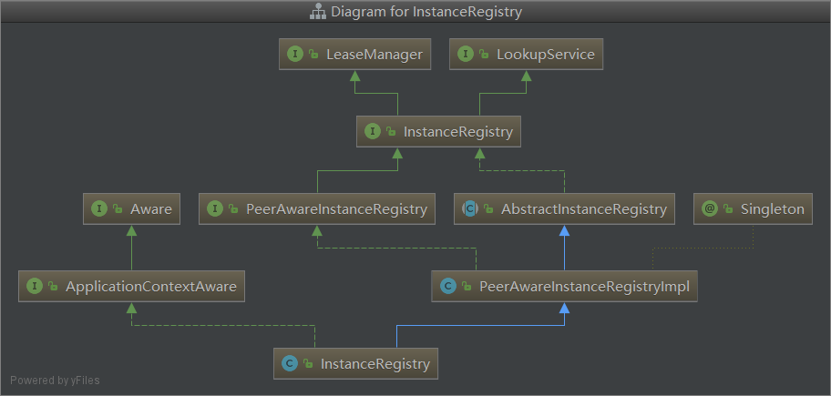
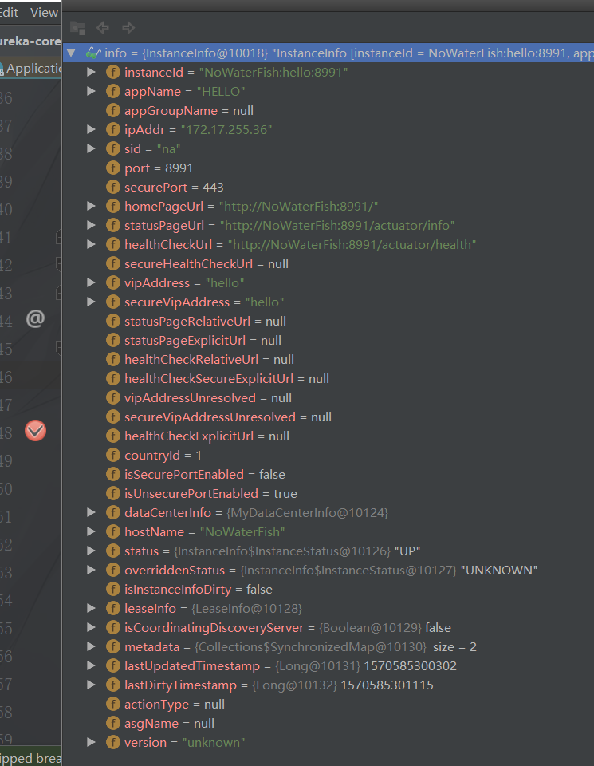

# Eureka

## 概览

### 服务注册

​	服务发送rest请求向服务注册中心注册，携带自身的ip、port等，维护在一个双层map中

#### 服务端

最下面instanceRegisrty是spring的主要负责事件的发布服务注册相关工作有netflix的eureka组件负责



- 接收注册请求

  com.netflix.eureka.resources.ApplicationResource#addInstance方法（使用的jersey实现rest）

- 检查续约时间设定

  org.springframework.cloud.netflix.eureka.server.InstanceRegistry#resolveInstanceLeaseDuration

```java
//如果服务提供者没有设置或者设置时间无效就使用默认值，反之使用设置的值
private int resolveInstanceLeaseDuration(final InstanceInfo info) {
		int leaseDuration = Lease.DEFAULT_DURATION_IN_SECS;
		if (info.getLeaseInfo() != null && info.getLeaseInfo().getDurationInSecs() > 0) {
			leaseDuration = info.getLeaseInfo().getDurationInSecs();
		}
		return leaseDuration;
	}
//服务提供者设定的参数值
org.springframework.cloud.netflix.eureka.EurekaInstanceConfigBean#leaseExpirationDurationInSeconds
```

- 发布服务注册事件

  org.springframework.cloud.netflix.eureka.server.InstanceRegistry#handleRegistration

-  注册到服务中心

  com.netflix.eureka.registry.AbstractInstanceRegistry#register

  ```java
  //注册信息维护在一个双层map中，外层key是appName，内层key是instenceId
  private final ConcurrentHashMap<String, Map<String, Lease<InstanceInfo>>> registry
              = new ConcurrentHashMap<String, Map<String, Lease<InstanceInfo>>>();
  
  //InstanceInfo  每个服务的属性实例
  //Lease  服务注册状态的实例，
  
  
  //注册时检测是否已存在当前appName的instanceId的应用，如果存在且还没有过期就使用原先存在的InstanceInfo，只需要更新一些属性，否则使用注册请求的InstanceInfo
  ```

  

- 将信心同步到兄弟节点

  com.netflix.eureka.registry.PeerAwareInstanceRegistryImpl#replicateToPeers

  ```java
   
              //如果是其他节点同步过来或者服务为空就不同步		
              if (peerEurekaNodes == Collections.EMPTY_LIST || isReplication) {
                  return;
              }
  
              for (final PeerEurekaNode node : peerEurekaNodes.getPeerEurekaNodes()) {
                  //自身忽略
                  if (peerEurekaNodes.isThisMyUrl(node.getServiceUrl())) {
                      continue;
                  }
                  replicateInstanceActionsToPeers(action, appName, id, info, newStatus, node);
              }
  ```

  

#### 客户端


com.netflix.discovery.DiscoveryClient#initScheduledTasks

### 服务续约

服务提供者每隔一定时间（30s）向注册中心发送请求进行续约，防止被剔除

### 服务同步

​	多个服务注册中心之间进行服务注册信息的同步，维护服务的一致性

### 获取服务

​	服务注册时获取服务注册中心维护的只读服务列表默认服务和服务注册中心的列表都是30秒跟新

### 服务调用

​	服务获取到清单后根据请求以及服务的region和zone的关系请求服务，一个region包含多个zone，优先调用同一个zone的服务提供者

### 服务下线

​	当服务提供者需要重启或者下线时需要发送rest请求给注册中心，注册中心收到请求后会将该服务标记为down状态，并发布事件通知各个服务提供者

### 服务剔除

​	由于网络原因，服务提供者没有发起下线服务，注册中心启动时会创建定时任务，每隔一定时间（60s）就将超时没续约的服务进行剔除（默认90s）

### 自我保护

超过一定规模（85%）的服务与注册中心失去联系就会触发自我保护，避免因网络原因触发的服务剔除

## 源码

### 客户端配置

```java
线程数：心跳  服务获取
时间： 连接 读取超时时间
数量：实例个数单个注册中心 全部注册中心
是否压缩
是否注册、优先使用同一zone的服务


运行时修改是否生效？？？？？？？怎么实现的
```

### 服务端

```java
InstanceRegistry类维护服务注册表
org.springframework.cloud.netflix.eureka.server.InstanceRegistry#renew（）续约
org.springframework.cloud.netflix.eureka.server.InstanceRegistry#cancel（）下线
org.springframework.cloud.netflix.eureka.server.InstanceRegistry#register(com.netflix.appinfo.InstanceInfo, int, boolean) 注册
```


### lookupService

### eurekaClient

### discoverClient

### application

### applications

### instenceInfo



### EurekaBootStrap