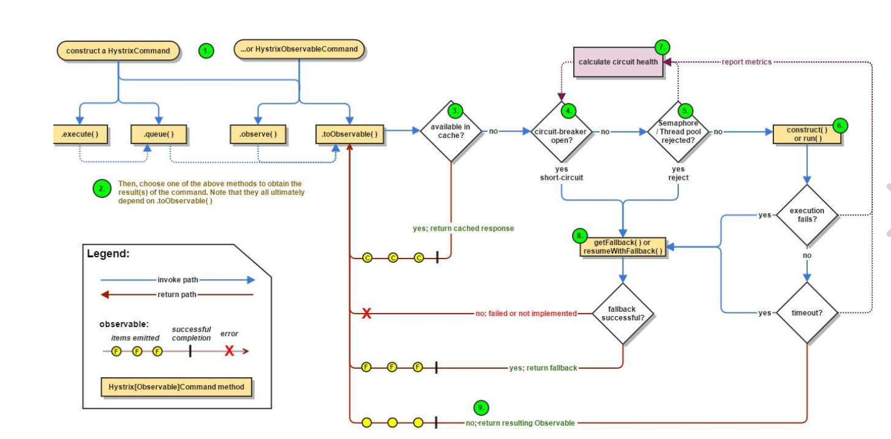

 




# 主要接口

## HystrixInvokable

```java
HystrixInvokable
//标志可以调用hystrix command的接口
```

## HystrixExecutable

```java
HystrixExecutable
HystrixCommand和HystrixCollapser的共同父类，以便在使用或合并时时能够相同对待

 public R execute();
//同步执行命令并返回结果

public Future<R> queue();
//通过为线程池添加任务返回future异步执行command，但是当设置了不用单独的线程运行时效果和execute一致

public Observable<R> observe();
//通过rxjava模式异步执行，ObservableExecutionMode = eagerly 即创建事件就发布，订阅者可能中途才加入，根据ExecutionIsolationStrategy和执行的值的改变会有不同的表现
```

## HystrixObservable

```java
HystrixObservable
实现了toObservable和observe两个方法的共同父类

public Observable<R> observe();
//通过rxjava模式异步执行，ObservableExecutionMode = eagerly 即创建事件就发布，订阅者可能中途才加入，根据ExecutionIsolationStrategy和执行的值的改变会有不同的表现

public Observable<R> toObservable();
//通过rxjava模式异步执行，ObservableExecutionMode = lazy 有订阅者才会发布事件，根据ExecutionIsolationStrategy和执行的值的改变会有不同的表现
```

## HystrixInvokableInfo

```java
HystrixInvokableInfo
定义了断路器执行时获取需要信息的方法
```

## HystrixCollapserKey

```
HystrixCollapserKey
```


## HystrixKey

HystrixCommandGroupKey

HystrixThreadPoolKey

HystrixCommandKey

内部factory的静态map保存了  <name,key>的关系不用重复创建

## HystrixThreadPool


## HystrixCircuitBreaker

```java
HystrixCircuitBreaker
断路器


Factory内部类维护了command与breaker的关系

//是否允许请求通过，注意半开（即隔一定时间即使打开了断路器也尝试访问已检验服务是否复原）
public boolean allowRequest();
//断路器是否打开
public boolean isOpen();
//半开状态？？？？？？？？
void markSuccess();


HystrixCircuitBreakerImpl 断路器的默认实现
	isOpen()
    //如果打开，					 直接返回true
    //如果请求qps<配置的阈值		  返回false
    //如果错误数<配置的阈值   	  返回false
    //否者设置为打开以及打开时间，   返回true
    
    allowRequest()
    //设置了强制打开直接拒绝返回false
    //如果设置了强制关闭，跑一下isOpen，允许请求通过  返回true
    //返回	!isOpen() || allowSingleTest();

    allowSingleTest()
    //再打开断路器一定时间后尝试请求

	markSuccess()
    //半开时请求成功会关闭断路器并重置度量指标
```

```java
HystrixCommandProperties
```

```java
HystrixCommandMetrics
```

# 具体类

```java
HystrixCommand
返回单个结果时创建的命令
R  value = execute();//同步执行返回结果
Future<R> result = queue();//异步执行返回future，从中获取结果
```

```java
HystrixObservableCommand
返回多个结果时创建的命令
observable hot = observable();
observable cold = toObservable();
```

是