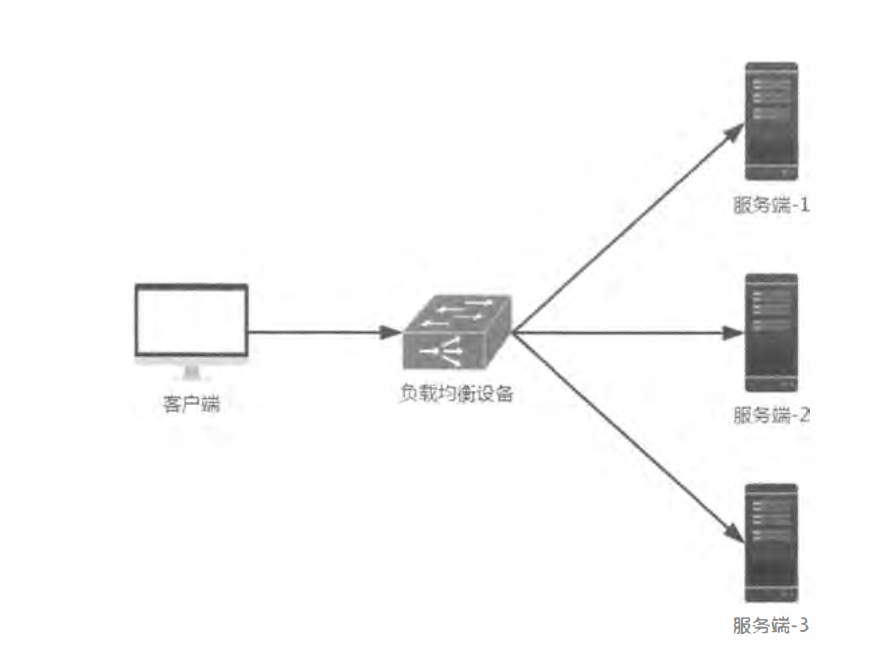

# 负载均衡

可以有效提高系统得并发能力

## 服务端：

即调用得服务得信息存放在负载服务端，客户端不要知道服务方得信息



## 客户端

客户端自身拥有调用得服务信息，自己选择服务

# 开启ribbon

1、引入pom依赖

2、启动类注入restTemplate

```java
@Bean
	@LoadBalanced
	public RestTemplate restTemplate() {
		return new RestTemplate();
	}
```


3、使用restTemplate调用服务


# 请求方式

## get

通过restTemplate使用个方法请求服务，分为getForEntity与getForObject，getForObject等价于getForEntity》getBody（），每种方法有三种重载形式

### getForEntity

请求方

```java
//使用string得url，可变数组填充参数
restTemplate.getForEntity("http://hello/client?name={}&age={}",String.class,"ss",20)
```

```java
//使用stringurl，用map填充占位符，占位符不能为空，且与map得key对应
Map<String,Object> param = new HashMap<>();
        param.put("name", "sss");
        param.put("age", 20);
        return restTemplate.getForEntity("http://hello/client?name={name}&age={age}",String.class,param)
                .getBody();
```

```java
//构建uri，且同时填充参数，注意占位符不为空就行 
UriComponents ss = UriComponentsBuilder.fromUriString("http://hello/client?name={name}&age={age}")
                .build()
                .expand("ss", 30)
                .encode();
        String body = restTemplate.getForEntity(ss.toUri(), String.class).getBody();
        return body;
```

接收方

```java
@RequestMapping
    public String hello(@RequestParam String name,@RequestParam String age) {
        return "hello i'm "+name+"from port:" + port+"i'm   "+age+" ages old";
    }
```


### getForObject

使用方式与getForEntity一致只是不需要在调用getBody了，直接获取得就是结果

## post

·

参数占位符

```java
//请求
ResponseEntity<String> post = restTemplate.
                postForEntity("http://hello/client?name={1}&age={1}", null, String.class, "post", 22);
        return post.getBody();

//接收
@RequestMapping
    public String hello(@RequestParam String name,@RequestParam String age) {
        return "hello i'm "+name+"from port:" + port+"i'm   "+age+" ages old";
    }
```

传递实体类

路径占位符

路径实体混合

```java
//请求
ResponseEntity<String> post = restTemplate.
                postForEntity("http://hello/client/bodyAndPathVarivle/{sex}", user, String.class,"nan");
        return post.getBody();

//接收 
@PostMapping("bodyAndPathVarivle/{sex}")
    public String body(  @RequestBody User user,@PathVariable String sex){
        return "hello i'm "+user.getName()+"from port:" + port+"i'm   "+user.getAge()+" ages old   "+sex;

    }
```


## put

将资源添加到服务，没有返回值

```java
//调用方
 @RequestMapping("put")
    public String put() {
        User user = new User("put",121);
        restTemplate.put("http://hello/client/put", user);
        return "put ok";
    }
//接收方
 @RequestMapping("put")
    public void put(@RequestBody User user) {
        System.out.println("ok");

    }
```


## delete

删除某个资源

```java
//调用方
@RequestMapping("delete")
    public String delete() {
        restTemplate.delete("http://hello/client/delete");
        return "put ok";
    }
//接收方
@RequestMapping("delete")
    public void delete() {
        System.out.println("ok");

    }
```

