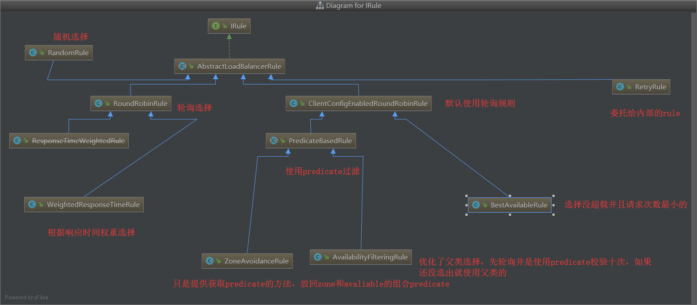
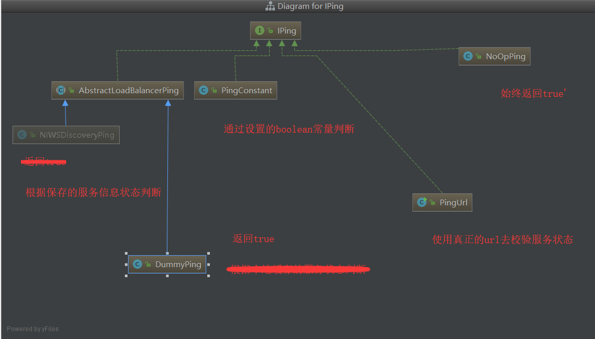

# 负载均衡

可以有效提高系统得并发能力

## 服务端：

即调用得服务得信息存放在负载服务端，客户端不要知道服务方得信息


## 客户端

客户端自身拥有调用得服务信息，自己选择服务

# 开启ribbon

1、引入pom依赖

2、启动类注入restTemplate

```java
@Bean
	@LoadBalanced
	public RestTemplate restTemplate() {
		return new RestTemplate();
	}
```


3、使用restTemplate调用服务


# 请求方式

## get

通过restTemplate使用个方法请求服务，分为getForEntity与getForObject，getForObject等价于getForEntity》getBody（），每种方法有三种重载形式

### getForEntity

请求方

```java
//使用string得url，可变数组填充参数
restTemplate.getForEntity("http://hello/client?name={}&age={}",String.class,"ss",20)
```

```java
//使用stringurl，用map填充占位符，占位符不能为空，且与map得key对应
Map<String,Object> param = new HashMap<>();
        param.put("name", "sss");
        param.put("age", 20);
        return restTemplate.getForEntity("http://hello/client?name={name}&age={age}",String.class,param)
                .getBody();
```

```java
//构建uri，且同时填充参数，注意占位符不为空就行 
UriComponents ss = UriComponentsBuilder.fromUriString("http://hello/client?name={name}&age={age}")
                .build()
                .expand("ss", 30)
                .encode();
        String body = restTemplate.getForEntity(ss.toUri(), String.class).getBody();
        return body;
```

接收方

```java
@RequestMapping
    public String hello(@RequestParam String name,@RequestParam String age) {
        return "hello i'm "+name+"from port:" + port+"i'm   "+age+" ages old";
    }
```


### getForObject

使用方式与getForEntity一致只是不需要在调用getBody了，直接获取得就是结果

## post

·

参数占位符

```java
//请求
ResponseEntity<String> post = restTemplate.
                postForEntity("http://hello/client?name={1}&age={1}", null, String.class, "post", 22);
        return post.getBody();

//接收
@RequestMapping
    public String hello(@RequestParam String name,@RequestParam String age) {
        return "hello i'm "+name+"from port:" + port+"i'm   "+age+" ages old";
    }
```

传递实体类

路径占位符

路径实体混合

```java
//请求
ResponseEntity<String> post = restTemplate.
                postForEntity("http://hello/client/bodyAndPathVarivle/{sex}", user, String.class,"nan");
        return post.getBody();

//接收 
@PostMapping("bodyAndPathVarivle/{sex}")
    public String body(  @RequestBody User user,@PathVariable String sex){
        return "hello i'm "+user.getName()+"from port:" + port+"i'm   "+user.getAge()+" ages old   "+sex;

    }
```


## put

将资源添加到服务，没有返回值

```java
//调用方
 @RequestMapping("put")
    public String put() {
        User user = new User("put",121);
        restTemplate.put("http://hello/client/put", user);
        return "put ok";
    }
//接收方
 @RequestMapping("put")
    public void put(@RequestBody User user) {
        System.out.println("ok");

    }
```


## delete

删除某个资源

```java
//调用方
@RequestMapping("delete")
    public String delete() {
        restTemplate.delete("http://hello/client/delete");
        return "put ok";
    }
//接收方
@RequestMapping("delete")
    public void delete() {
        System.out.println("ok");

    }
```

# 源码解读

## RibbonClientConfiguration

对ribbion的客户端进行配置


获取客户端配置

```java
@Bean
	@ConditionalOnMissingBean
	public IClientConfig ribbonClientConfig() {
		DefaultClientConfigImpl config = new DefaultClientConfigImpl();
		config.loadProperties(this.name);
        //设置默认连接、读取超时时间，是否使用压缩传输数据
		config.set(CommonClientConfigKey.ConnectTimeout, DEFAULT_CONNECT_TIMEOUT);
		config.set(CommonClientConfigKey.ReadTimeout, DEFAULT_READ_TIMEOUT);
		config.set(CommonClientConfigKey.GZipPayload, DEFAULT_GZIP_PAYLOAD);
		return config;
	}
```

注入服务过滤器

```java
@Bean
	@ConditionalOnMissingBean
	public IRule ribbonRule(IClientConfig config) {
		if (this.propertiesFactory.isSet(IRule.class, name)) {
			return this.propertiesFactory.get(IRule.class, config, name);
		}
		ZoneAvoidanceRule rule = new ZoneAvoidanceRule();  //默认使用区域优先、可使用
		rule.initWithNiwsConfig(config);
		return rule;
	}
```

注入负载均衡器

```java
@Bean
	@ConditionalOnMissingBean
	public ILoadBalancer ribbonLoadBalancer(IClientConfig config,
			ServerList<Server> serverList, ServerListFilter<Server> serverListFilter,
			IRule rule, IPing ping, ServerListUpdater serverListUpdater) {
		if (this.propertiesFactory.isSet(ILoadBalancer.class, name)) {
			return this.propertiesFactory.get(ILoadBalancer.class, config, name);
		}
		return new ZoneAwareLoadBalancer<>(config, rule, ping, serverList,
				serverListFilter, serverListUpdater);
	}
```

对服务列表进行筛选

```java
@Bean
	@ConditionalOnMissingBean
	@SuppressWarnings("unchecked")
	public ServerListFilter<Server> ribbonServerListFilter(IClientConfig config) {
		if (this.propertiesFactory.isSet(ServerListFilter.class, name)) {
			return this.propertiesFactory.get(ServerListFilter.class, config, name);
		}
		ZonePreferenceServerListFilter filter = new ZonePreferenceServerListFilter();
		filter.initWithNiwsConfig(config);
		return filter;
	}
```


注入服务可用检测器

```java
//在负载均衡时先校验该服务是否可用，默认使用得实现是默认可用
@Bean
	@ConditionalOnMissingBean
	public IPing ribbonPing(IClientConfig config) {
		if (this.propertiesFactory.isSet(IPing.class, name)) {
			return this.propertiesFactory.get(IPing.class, config, name);
		}
		return new DummyPing();
	}
```

注入服务列表????

```java
@Bean
	@ConditionalOnMissingBean
	@SuppressWarnings("unchecked")
	public ServerList<Server> ribbonServerList(IClientConfig config) {
		if (this.propertiesFactory.isSet(ServerList.class, name)) {
			return this.propertiesFactory.get(ServerList.class, config, name);
		}
		ConfigurationBasedServerList serverList = new ConfigurationBasedServerList();
		serverList.initWithNiwsConfig(config);
		return serverList;
	}
```

服务列表跟新类

```java
@Bean
	@ConditionalOnMissingBean
	public ServerListUpdater ribbonServerListUpdater(IClientConfig config) {
		return new PollingServerListUpdater(config);
	}
```

其他

```java
@Bean
	@ConditionalOnMissingBean
	public RibbonLoadBalancerContext ribbonLoadBalancerContext(ILoadBalancer loadBalancer,
			IClientConfig config, RetryHandler retryHandler) {
		return new RibbonLoadBalancerContext(loadBalancer, config, retryHandler);
	}

	@Bean
	@ConditionalOnMissingBean
	public RetryHandler retryHandler(IClientConfig config) {
		return new DefaultLoadBalancerRetryHandler(config);
	}

	@Bean
	@ConditionalOnMissingBean
	public ServerIntrospector serverIntrospector() {
		return new DefaultServerIntrospector();
	}
```

## RibbonAutoConfiguration

对ribbon进行自动配置


```java
	//注入客户端工厂，创建客户端，并且每个客户端都会拥有自己的上下文Spring ApplicationContext
	@Bean
	public SpringClientFactory springClientFactory() {
		SpringClientFactory factory = new SpringClientFactory();
		factory.setConfigurations(this.configurations);
		return factory;
	}
```


```java
//负载均衡的客户端执行请求	
@Bean
	@ConditionalOnMissingBean(LoadBalancerClient.class)
	public LoadBalancerClient loadBalancerClient() {
		return new RibbonLoadBalancerClient(springClientFactory());
	}
```


```java
	//在RetryTemplate存在时注入一个重试策略生产工厂
	@Bean
	@ConditionalOnClass(name = "org.springframework.retry.support.RetryTemplate")
	@ConditionalOnMissingBean
	public LoadBalancedRetryFactory loadBalancedRetryPolicyFactory(
			final SpringClientFactory clientFactory) {
		return new RibbonLoadBalancedRetryFactory(clientFactory);
	}
```


## LoadBalancerAutoConfiguration

对ribbon的负载均衡进行自动配置


拦截器配置

```java
	
	@Configuration
	@ConditionalOnMissingClass("org.springframework.retry.support.RetryTemplate")
	static class LoadBalancerInterceptorConfig {

		@Bean
		public LoadBalancerInterceptor ribbonInterceptor(
				LoadBalancerClient loadBalancerClient,
				LoadBalancerRequestFactory requestFactory) {
			return new LoadBalancerInterceptor(loadBalancerClient, requestFactory);
		}

		@Bean
		@ConditionalOnMissingBean
		public RestTemplateCustomizer restTemplateCustomizer(
				final LoadBalancerInterceptor loadBalancerInterceptor) {
			return restTemplate -> {
				List<ClientHttpRequestInterceptor> list = new ArrayList<>(
						restTemplate.getInterceptors());
				list.add(loadBalancerInterceptor);
				restTemplate.setInterceptors(list);
			};
		}

	}
```


## 主要接口

### IRule 

负载均衡算法




```java
retry

内部包含一个irule可以在一定时间内反复尝试
```

```
RandomRule
随机选择，根据所有服务范围选取随机数从有效服务中获取，直到获取的服务可用为止
```

```java
RoundRobinRule
轮询从所有服务中选择，不管是否可用
```

```java
WeightedResponseTimeRule
通过响应时间权重选取服务
权重依次为= 之前权重 + （总平均时间-自身平均时间）

选取时根据最后一个权重产生一个平均数，如果轮询服务的权重》=时返回，   因此自身花费时间越少，增量越大占据的区间越大，被选中的几率越大，当服务列表与权重列表size不相等时就采用父类的方式
```

```java
ClientConfigEnabledRoundRobinRule
委托给内部的轮询RoundRobinRule
```

```java
BestAvailableRule
选择没有负载并且请求数量最小的
```

```java
PredicateBasedRule
根据内部的predicate选择服务
```

```
ZoneAvoidanceRule
PredicateBasedRule的子类内部是一个由ZoneAvoidancePredicate与AvailabilityPredicate组合的predicate
```

```java
AvailabilityFilteringRule
//PredicateBasedRule的子类重写了choose方法先轮询选择并通过predicate(断路器是否打开即服务是否故障，并发数大于阈值)判断十次失败就使用父类的
```


### Iping:

```java
public interface IPing {
    //校验服务是否还可以使用
    public boolean isAlive(Server server);
}
```




### IloadBalancer

由三部分组成

1、存放服务列表

2、选择策略

3、确定可用性

```java

```


### Servlist

### ServerListUpdater

### ServerlistFilter

# ribbon与eureka整合

