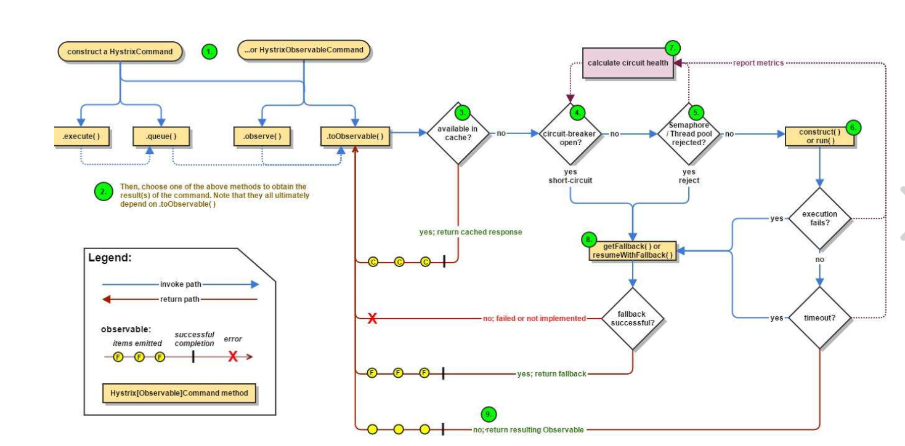
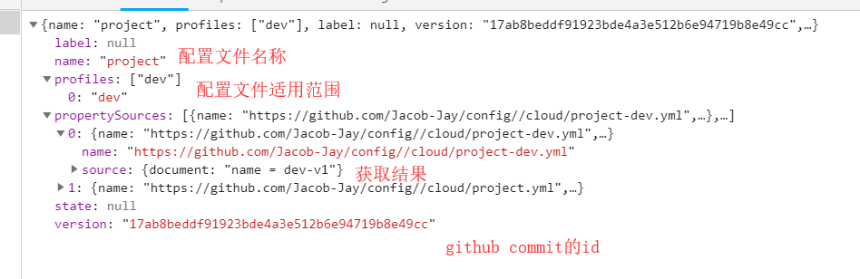
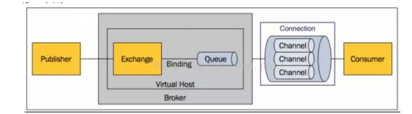

# eureak（服务）

1. 服务注册与发现

   1. 注册中心

      1. 服务剔除：服务非正常下线时将超过配置时间未续约的服务剔除
      2. 以一个双层map维护

   2. 服务

      1. 启动时会向注册中心发送请求注册自身（eureka.client.registerWithEureka=true确定是否注册）
      2. eureka.client.fetchRegistry=true确定是否从服务中心拉取服务列表
      3. 服务续约（间隔、失效两个参数）
      4. 获取服务（30秒更新默认是指客户端30秒去获取一次还是服务中心30秒更新一次？？？）
      5. 服务下线（发送请求，告知注册中心，注册中心会广播下线事件）
      6. 

   3.  实现逻辑

      1.  com.netflix.discovery.DiscoveryClient#initScheduledTasks，在构造方法中使用调度线程完成注册，续约以及获取服务的
      2. 服务续约com.netflix.discovery.DiscoveryClient#renew
      3. 注册中心接收注册请求com.netflix.eureka.resources.ApplicationResource#addInstance

      ​	

2. 自我保护

   1. 在15分钟内（可配置？？）心跳率低于85%的服务

3. region和zone

   

4. 配置

   1. 服务名称
   2. ip

# ribbon（消费者）

1. 使用restemplate实现负载均衡
2. 轮询算法（以及自定义）

# fegin（消费者）

1. 使用接口模拟httpClient实现负载均衡

2. ```java
   //使用接口访问服务，参数与调用服务一致，实现类作为降级处理
   @FeignClient(value = "CLIENT-HI",fallback = HytrixError.class)
   @Service
   public interface HelloService {
   
       @RequestMapping("/hello")
       //必须加value否则报错
       String hello(@RequestParam(value = "name") String name);
       @RequestMapping("feign1")
       public String feign1(@RequestParam("name") String name) ;
       @RequestMapping("feign2")
       public User feign2(@RequestHeader("name") String name, @RequestHeader("age") Integer age);
       @RequestMapping("feign3")
       public String feign3(@RequestBody User user);
   
   }
   ```

3. ```java
   由于服务提供段和服务消费端接口一致可以单独提取一个项目两边引用继承
   ```

4. ```java
   serviceName.ribbon.key = value  指定特定服务的配置 
   ```

   ```java
   ad 
   ```

   ```java
   ad 
   ```

   ```java
   ad 
   ```

   ```java
   ad 
   ```

   ```java
   ad 
   ```

   ```java
   ad 
   ```

   ```java
   ad 
   ```

   

# hytrix（熔断）

1. 服务熔断
   1. ribbon：添加注解设定错误回掉方法
   2. fegin：自身就具有hytrix，但是需要配置文件打开，并且将接口实现类注册到容器中
   
2. 服务降级

3. ```java
   1	//包装请求可能有风险的服务的请求，使用了命令模式
   HystrixComand   //单个结果   
       	//hot    ===》observer  无论是否有订阅者都会发布事件，订阅者接收部分事件
       	//cold ====》toObservable   有订阅者才会发布订阅者接收所有事件
   HystrixObservableCommand //多个结果
   
   2	执行处理
       
   3   结果是否被缓存（如果缓存功能开启且命中直接返回否则继续）
   4	断路器是否打开，如果打开直接至8
   5	检查资源是否用完（线程池，请求队列、信号量）用完至8，每个服务的资源是分割的不会互相影响
       
   6	执行请求，异常超时至8，否则返回结果至7
   7	计算短路器的健康值
   8	服务降级处理，尽量保证最后获取返回值的是本地的，否则就需要根据执行方法做出不同响应
   ```

4. ```java
   HystrixCircuitBreaker //断路器
       allowRequest//是否允许请求
       isOpen//断路器是否打开，根据标志或者度量指标qps以及错误百分比，打开时是记录时间com.netflix.hystrix.HystrixCircuitBreaker.HystrixCircuitBreakerImpl#isOpen
      
       				
       markSuccess //  闭合断路器，当请求成功时将打开的断路器关闭
       内部类
       Factory  //缓存了命令与断路器的关系
       NoOpCircuitBreaker //空实现
       HystrixCircuitBreakerImpl//基本实现（通过isopen和allowSingleTest实现断路器状态自动化）
       	properties //命令的属性
       	HystrixCommandMetrics  //命令的度量指标
       	circuitOpen  //断路器打开标志
       	circuitOpenedOrLastTestedTime  //断路器上一次打开或测试的时间戳
   ```

5. ```java
   使用线程池分离降低了服务之间的影响，会在一定程度上增加响应延迟，如果对延迟要求比较高的服务可以使用信号量代替线程池
   ```

6. ```java
   //异步请求
   ```

7. ```java
   //服务降级即使用一个本地方法返回值，指挥忽略HystrixBadRequestException异常可以通过ignoreExceptions忽略异常不触发降级处理
   	@HystrixCommand(fallbackMethod = "default"，ignoreExceptions = RuntimeException.class)
       public String helloError(String name,Throwable throwable) {
           return 。。。 //网络请求时仍需要注解标识
       }
   
   //当方法是本地处理时可以不进行降级处理
   

   @HystrixCommand
   	fallbackMethod  //降级处理方法
       ignoreExceptions  //不做处理的异常
       commandKey   //命令的key
       groupKey   //分组key   通常将组作为一个单位共享线程池
        threadPoolKey  //在group的基础之上在进行细分   
           
   ```
   
8. ```java
   	请求缓存
      	@CacheResult//开启缓存 默认key为参数组装
	@CacheRemove(commandKey = "helloAsync")  //清除缓存key为放入缓存的命令的key
      	可以通过以上两个注解的cacheKeyMethod值设置缓存key（优先级高）
      	也可以通过@CacheKey("name")制定缓存key
   ```
   
9. ```java
   //请求合并，将一定时间内的同一个服务的请求合并起来一次性请求
   com.netflix.hystrix.HystrixCollapser
   
    @HystrixCollapser(batchMethod = "getAll",collapserProperties = {
               @HystrixProperty(name = "timerDelayInMilliseconds",value = "100")
       }) //将100ms内单个请求合并到一起进行请求，只有在并发量高时才会提高系统性能，否则会降低性能
   ```

10. ```java
    //配置文件  从后往前依次覆盖
    1. 全局默认值
    2. 全局配置
    3. 实例默认值
    4. 实例配置值
    
    ```

11. command 控制HystrixCommand.run()的执行

    ```java
    execution.isolation.strategy  //控制隔离级别
        //thread  独立线程运行，受线程池中的线程数量约束
        //semaphore  信号量，调用线程上运行，受信号量计数约束
        
    execution.isolation. thread.timeoutinMilliseconds  //命令执行超时时间
    
    execution.timeout.enabled   //命令执行是否进行超时后进行服务降级
    
    execution.isolation.thread.interruptOnTimeout //超时时是否中断
    
    execution.isolation.thread.interruptOnCancel //取消时是否中断
    
    execution.isolation.semaphore.maxConcurrentRequests  //信号量控制时最大值
    
    ```

    

12. fallBack控制HystrixComrnand.getFallback ()的执行

    ```java
    fallback.isolation.semaphore. maxConcurrentRequests  //该方法执行的最大数量，超过抛异常
        
     fallback.enabled //是否开启服务降级   
    ```

13. circuitBreaker控制断路器的表现

    ```java
    circuitBreaker.enabled  //命令执行失败时是否跟踪健康状况和熔断请求
        
    circuitBreaker.requestVolumeThreshold  //滚动窗口失败触发熔断的个数
    
    circuitBreaker.sleepWindowinMilliseconds  //短路器休眠的时间，即打开断路器到尝试关闭的时间
    
    circuitBreaker.errorThresholdPercentage  //打开断路器的错误百分比阈值
    
    circuitBreaker.forceOpen   //是否强制打开断路器拒绝所有请求
    
    circuitBreaker.forceClosed   //是否强制关闭断路器接受所有请求
    ```

14. metrics  性能指标相关的参数

    ```java
    metrics.rollingStats.timeinMillionseconds  // 断路器收集信息的时间窗口
        
    metrics.rollingStats.numBuckets     //桶数量 和时间窗口结合给定统计的信息的单位时间必须整除，且不能动态修改
    
    me丘ics.rollingPercentile.bucketSize // 计算执行次数的值，比如100，执行了150次只统计最后50次的
    
    metrics.rollingPercentile.enabled  //
    
    metrics.rollingPercentile.timeinMilliseconds //
    
    metrics.rollingPercentile.numBuckets  //
    
    metrics.healthSnapshot.intervalinMilliseconds//
    ```

15. 合并请求参数

    ```java
    maxRequestsinBatch  //一次合并的最大请求数
        
    timerDelayinMillionseconds     //合并请求的单位时间
    
    requestCache.enabled  //是否开启缓存
    ```

16. 线程池属性

    ```java
    coreSize  //线程池的核心数，即最大并发数量
        
    maxQueueSize//最大队列容量
    
    queueSizeRejectionThreshold  //拒绝的量，即使没达到最大队列量
    ```

    

17. sd 

18. sd

19. 

20. 


# zull（路由）

```java
概述：
	对服务访问路径通过eureka注册中心进行自动化，降低维护人员的工作
	同一控制整个系统的权限限制
	具有负载均衡功能？？？？
	熔断功能？？？？
```


```java
入门demo：
	引入依赖
	使用@enableZuulProxy开启路由功能
	
	配置路由关系：路由context转发到url或者服务（二选一）
		zuul.routes.api-a.path=/api-a/**             
		zuul.routes.api-a.url=http://localhost:8080/      无需注册到服务中心
		zuul.routes.api-a.serviceId=hello-service		 需要注册到服务中心	推荐使用
	将localhost：zullport/api-a/xxx重新路由到url为http://localhost:8080/xxx
	或者服务名为hello—service/xxx
```


```java
//创建过滤器对请求进行过滤
@Component
public class RouteFilter extends ZuulFilter {

    /**
     * 定义过滤器的执行时机
     * 1、pre    路由前执行
     * 2、route  路由时
     * 3、post    路由之后  错误之前
     * 4、error  发生错误
     * @return
     */
    @Override
    public String filterType() {
        return "pre";
    }

    /**
     * 存在多个过滤器时，定义当前路由器的执行顺序
     * @return
     */
    @Override
    public int filterOrder() {
        return 0;
    }

    /**
     * 定义是否需要进行过滤，可以根据请求进行判断
     * @return
     */
    @Override
    public boolean shouldFilter() {
        //获取当前请求
        RequestContext ctx = RequestContext.getCurrentContext();
        HttpServletRequest request = ctx.getRequest();
        return true;
    }

    @Override
    public Object run() throws ZuulException {

        //获取当前请求
        RequestContext ctx = RequestContext.getCurrentContext();
        HttpServletRequest request = ctx.getRequest();

        Object name = request.getParameter("name");
            if(name == null) {
                //是否返回路由的响应
                ctx.setSendZuulResponse(false);
                //设置响应状态码
                ctx.setResponseStatusCode(401);
                ctx.setResponseBody("name is empty");

                return null;
            }
            if (!"jq".equals(name)) {
                ctx.setSendZuulResponse(false);
                ctx.setResponseStatusCode(402);
                ctx.setResponseBody("name isn't  jq");
                return null;
            }
            System.out.println("ok");

        return null;

    }
}
```


```java
路由详解
	传统路由：不用进行服务注册，直接将请求转发到给定的url
		单实列：转发到唯一的url
			zuul. routes.user - service.path=/user - service/xx
			zuul.routes. user - service.url=http:/ /localhost:8080/
        多实例：动态负载均衡的转发到配置的各个url
        	zuul.routes.user - service.path=/user - service/xx
			zuul. routes.user - service.serviceid=<user - servicename>   //服务名称
			ribbon.eureka.enabled=false//由于需要负载均衡，但是有没有注册到服务中心所以禁用手动配置
			<user - servicename>.ribbon.listOfServers=
					http://localhost:8080/,http://localhost:8081/     //配置服务对应的地址
	
	服务路由：需要注册到服务中心，根据服务名称进行转发
		zuul.routes.user-service.path=/user-service/xx
		zuul.routes.user-service.serviceid=user-serviceId
		可以简化为
		zuul.routes.user-serviceId=/user-service/xx
		
	默认路由：默认会为注册中心的服务创建路由信息，context为服务名称
			可以通过配置过滤某些不想开放的服务不自动生成路由
			zuul:
 			 ignored-services:
    			- client-hi
    			- service-ribbon-hystrix	
```


```java
自定义路由映射规则

```


```java
路径匹配规则
    /?  匹配一个字符
    /*  匹配一层，可以多个字符
    /** 匹配多层任意字符
    
    且匹配是按照yaml申明顺序来匹配并不是详细匹配
            zuul:
              routes:
                service-feign: /api-a/xx/**   调换顺序就会报错
                api-a:
                  path: /api-a/**
                  serviceId: service-ribbon-hystrix
    
    zuul.ignored-patterns=/**/hello/**  忽略满足改匹配的请求不进行路由
```


```java
路由前缀
		zuul.prefix=/api  //在原有路由之前具有改规则才会匹配，并且路由时会默认去除
```


```java
cookie与头信息
	由于默认会过滤cookie，下游应用会无法接收使用
	
	全部放行（不推荐）
		zuul.sensitiveHeaders=
	
	自定义路由放行
        ＃方法一：对指定路由开启自定义敏感头
        zuul.routes.<router>.customSensitiveHeaders=true
        ＃方法二：将指定路由的敏感头设置为空
        zuul.routes.<router>.sensitiveHeaders=
```


```java
请求从定向
	比如登陆跳转怎么解决
```


```java
过滤器详解
核心过滤器  org.springframework.cloud.netflix.zuul.filters下

com.netflix.zuul.http.ZuulServlet


  public void service(javax.servlet.ServletRequest servletRequest, javax.servlet.ServletResponse servletResponse) throws ServletException, IOException {
        try {
            init((HttpServletRequest) servletRequest, (HttpServletResponse) servletResponse);

            // Marks this request as having passed through the "Zuul engine", as opposed to servlets
            // explicitly bound in web.xml, for which requests will not have the same data attached
            RequestContext context = RequestContext.getCurrentContext();
            context.setZuulEngineRan();

            try {
                preRoute();
            } catch (ZuulException e) {
                error(e);
                postRoute();
                return;
            }
            try {
                route();
            } catch (ZuulException e) {
                error(e);
                postRoute();
                return;
            }
            try {
                postRoute();
            } catch (ZuulException e) {
                error(e);
                return;
            }

        } catch (Throwable e) {
            error(new ZuulException(e, 500, "UNHANDLED_EXCEPTION_" + e.getClass().getName()));
        } finally {
            RequestContext.getCurrentContext().unset();
        }
    }


	// 过滤类型  
    	pre     常用于请求的校验
    		ServletDetectionFilter
    		Servlet30WrapperFilter
    		FormBodyWrapperFilter
    		DebugFilter
    		PreDecorationFilter
    		
    	routing		将请求转发到具体的服务（serviceId  url  forword）	
    	post		处理响应
    	error	   发生异常时执行，但最终流向post
    	
	//执行顺序  order方法返回值   越小越优先
	//执行条件  判断是否进行过滤	
	//具体操作
		
		

```


# config

## server

```java
1、引入依赖
2、启动类加载@EnableConfigServer
3、在config仓库下创建cloud目录，创建四个配置文件：
	project.yml			name = default-v1
	project-dev.yml		name = dev-v1
	project-test.yml	name = test-v1
	project-pro.yml		name = test-v1
	为了测试版本创建v2分支，也是这四个配置文件
	project.yml			name = default-v2
	project-dev.yml		name = dev-v2
	project-test.yml	name = test-v2
	project-pro.yml		name = test-v2
4、启动服务进行访问，url规则：
	/{application}/{profile}[/{label}]  		/project/dev/v2      		
	/{application}-{profile}.yml				/project-dev.yml
	/{label}/{application}-{profile}.yml		/v2/project-dev.yml
	/{application}-{profile}.properties			/project-dev.roperties
	/{label}/{application}-{profile}.properties /v2/project-dev.properties
	以上为映射结果关系，v2代表分支可以不写默认为master
	访问具体文件时返回的时文件内容
	如果转换为url访问返回的：见下图
	
```




```java
服务端主要是从仓库获取配置文件，保存至本地
	如果有请求获取配置先从远端获取，获取不到就返回本地之前保存的
```


## client

```java
1、引入依赖
2、bootstrap.yml配置server相关信息
	spring.application.name=project				//必须为配置文件命名的porject-dev的project
	spring.cloud.config.profile=dev				//project-dev的dev
	spring.cloud.config.label=v2				//分支名称 不写默认为master
	spring.cloud.config.uri=http://localhost:7001/		//配置服务的url
3、获取配置文件的值
	1、@value 使用注解获取
	
	@Value("${age}")
    private int age;
    @Value("${name}")
    private String name;

    @RequestMapping("value")
    public String hello() {
        return name + "   " + age;
    }
	
	2、org.springframework.core.env.Environment#getProperty(java.lang.String)
	
	@Autowired
    private Environment environment;

    @RequestMapping("env")
    public String env() {
        return environment.getProperty("name") + "   " + environment.getProperty("age");
    }
```


```java
 cloud:
    config:
      server:
        git:
          uri: https://github.com/Jacob-Jay/{application}/ 
          search-paths: cloud                            
          username: 819657451@qq.com                         
          password: 697294jq.
          basedir: D:/own/localHistory      //设置本地存储的位置，不再使用默认位置
              
              
    application由url规则的{application}代替
    
    
    
 多仓库 ：动态管理多个项目的配置文件XXXXXXXXXXXXXXXXXXXXXXXXXXXXXXXXXXXXXXXXXX
 
  cloud:
    config:
      server:
        git:
          uri: https://github.com/Jacob-Jay/config/      //默认位置，其他仓库找不到是这里找
          search-paths: cloud                          
          username: 819657451@qq.com                                 
          password: 697294jq.
          repos:
            config2: https://github.com/Jacob-Jay/config2/cloud   //有问题
            jq:							//映射application为project的去配置的路径下找
              pattern: project/*				
              uri: https://github.com/Jacob-Jay/config/cloud
```

```java
健康监测
	http://localhost:8991/actuator/health
	可以根据配置的https://github.com/Jacob-Jay/config/   去检测是否能联通，如果使用通配符时会默认创建一个app的application，因为不存在该长裤检测结果为down，服务化时会影响结果，解决办法：
	1、创建一个app仓库
	2、指定检测的仓库而不是默认的app
		cloud:
        config:
          server:
            health:
              repositories:     //为map可以配置多个key为check和check2
                check:			
                  name: config
                  profiles: dev
                 check2:
                  name: config
                  profiles: dev
```

```java
所有客户端通过服务中心获取的name和from都是固定的，不论git仓库配置文件总是啥

spring.cloud.config.server.overrides.name=didi
spring.cloud.config.server.overrides.from=shanghai
```

安全

```java
由于配置中心不可能所有人都能访问所以添加security进行访问控制，不适用随机密码，通过配置写死，可以用数据库动态
	spring:
      security:
        user:
          name: jq
          password: 123
              
客户端访问：配置文件添加
spring.cloud.config.username=jq
spring.cloud.config.password=123
```

加密访问

```java
需要替换jar包（security的）

对称加密
	bootstrap.yml配置密钥encryt.key=自己写
	http://localhost:8991/encrypt   对参数加密
	http://localhost:8991/decrypt   对加密结果解密
	
properties使用{cipher}表明是加密值
spring.datasource.password={cipher}dba6505baa8ld78bd08799d8d4429de499bd4c2053c0
5f029e7cfbf143695f5b
yml配置需要用‘’包起
spring:
  security:
    user:
      name: jq
#      password: 123
      password: '{cipher}79df3e1b6843873ca841fd961f64b3fd12b3900d95c3f398006b95e8da419d18'
          
          
  非对称加密        
```

作为服务提供，并不是通过传统的url

```java
服务端只需要注册到eureka
eureka:
  client:
    serviceUrl:
      defaultZone: http://localhost:8761/eureka/


客户端修改连接方式
spring:
  application:
    name: config
  cloud:
    config:
      profile: dev
      uri: http://localhost:8991/
      label: v2
      username: jq
      password: 123
      name: project
      
   修改为
   
spring:
  application:
    name: config
  cloud:
    config:
      name: config2    //{application} 决定仓库优先级高于spring.application.name
      profile: dev
#      uri: http://localhost:8994/
      discovery:
        enabled: true
        service-id: configServer
      label: v2
      password: 123
      username: jq
eureka:
  client:
    serviceUrl:
      defaultZone: http://localhost:8761/eureka/

```

```java
配置客户端连接服务端时会预先加载其他信息，万一配置服务无效，加载相当于无用功，所以设置
spring.cloud.config.failFast= true  先加载配置服务
但是可能由于网络问题，需要重试
只需要在pom添加依赖
    <dependency>
        <groupid>org.springframework.retry</groupid>
        <artifactid>spring-retry</artifactid>
    </dependency>
    <dependency>
        <groupid>org.springframework.boo七</groupid>
        <artifactid>spring-boot-starter-aop</ar七ifactid>
    </dependency>
    
```

### 刷新

```java
pom添加依赖
		<dependency>
			<groupId>org.springframework.boot</groupId>
			<artifactId>spring-boot-starter-actuator</artifactId>
		</dependency>
controller添加注解	
		@RefreshScope 
配置文件添加
	management:
      endpoints:
        web:
          exposure:
            include: '*'
访问url刷新 必须post
http://localhost:8993/actuator/refresh
```


# BUS(消息总线)

## 消息代理

```java
消息代理：一种消息验证、传输、路由的架构，解耦应用之间的通讯过程，实际就是一个消息中间件

使用场景:
	消息转换为其他形式
	聚集分解消息送至目的地，并返回结果给用户
	调用web服务检索数据
	发布订阅模式的消息路由
	响应事件或错误

常见产品：
	activeMq
	kafka
	rabbitMq
	rocketMq
```


## rabbitMq




```java
实现了amqp协议由erlong编写的而消息中间件

amqp：高级消息队列协议，面向消息层中间件的应用层协议
	消息队列
	消息方向
	消息路由
	可靠性
	安全性

基本概念
	broker：消息队列的服务器，负责接收生产者的消息，将其发送给消费者或者转发至其他broker，其实就是				rabbitMq的一个服务实例
	exchange：消息交换机，从生产者接收消息并按照一定规则路由到指定队列
	queue:消息队列，消息通过发送和路由之后最终到达的地方，一个消息可以到一个或多个消息队列，队列中的消息为			逻辑带消费状态
	binding：将exchange 和queue 按照一定规则绑定的虚拟连接
	routing  key:路由关键字，exchange将消息投递到queue的规则
	virtual host：虚拟主机，对服务器的虚拟划分，主要是为了不同用户的权限分离
	connection：消费者、生产者与broker之间的物理网络连接,只会由消费者生产者创建或关闭，除非网络问题
	channel：消息通道，连接生产者与消费者的逻辑通道，相当于一个会话
	producer：消息的生产者，制造并发送消息的程序
	consumer：消息的消费者，接收并处理消息的程序
	
	
	
	
基本步骤
获取连接  创建channle	  创建队列   发送或消费消息

exchange类型：
		direct：根据指定key交换
		topic：匹配交换
		fanout：广播模式，将消息投递到绑定的所有队列
		
消息持久化
	exchange :  durable>=1
	queue:		durable>=1
	bingding:	delivery_mode>=2  需要exchange和queue都是持久化时才能持久化
```


```java
客户端更新
	任意一个客户端都可以作为生产者，同时都是消费者，即某个客户端发送刷新消息后所有客户端都会消费消息对配置进行更新


	1、添加依赖
		<dependency>
			<groupId>org.springframework.cloud</groupId>
			<artifactId>spring-cloud-starter-bus-amqp</artifactId>
		</dependency>
		<dependency>
			<groupId>org.springframework.boot</groupId>
			<artifactId>spring-boot-starter-actuator</artifactId>
		</dependency>
	2、使用注解
		@RefreshScope 
	3、yml暴露刷新端点，配置mq
        management:
          endpoints:
            web:
              exposure:
                include: '*'
        spring:            
          rabbitmq:
            username: springcloud
            password: 123456
                
     4、访问url更新属性，post
     http://localhost:8994/actuator/bus-refresh
     

服务端更新
	类似于客户端，只是不需要使用注解，因为是客户端消费

	指定刷新范围待定：：：：：：：：：：：：：：：：：：：：：：：：：：
```

## kafka


